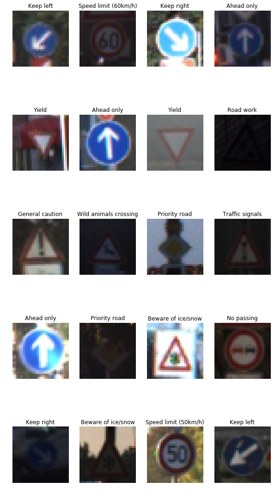
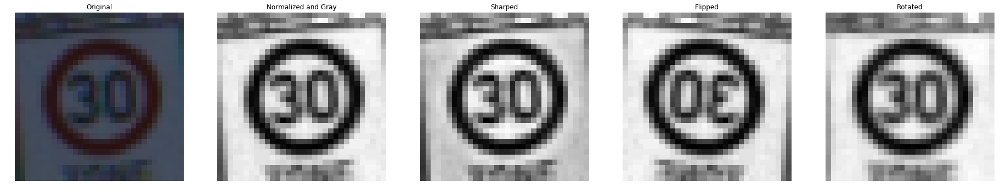
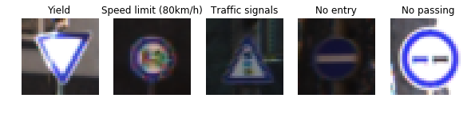
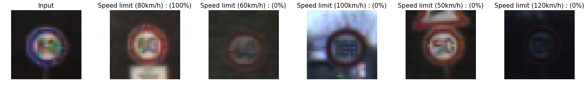
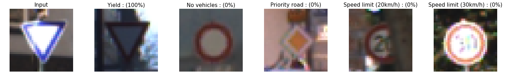
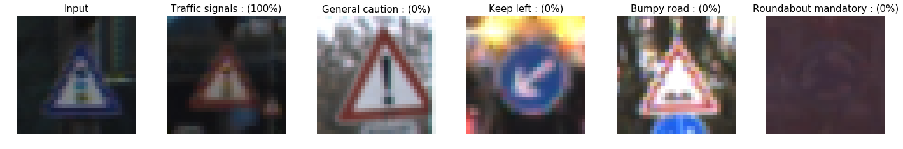
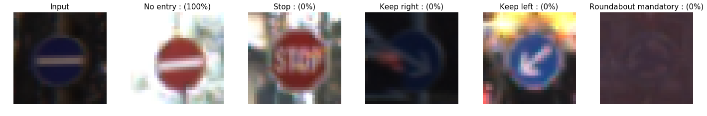
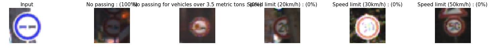

# **Traffic Sign Recognition** 

### Data Set Summary & Exploration

#### 1. Summary of the Data Set.

I used the pandas library to calculate summary statistics of the traffic
signs data set:

* The size of training set is 139196
* The size of the validation set is 17640
* The size of test set is 50520 
* The shape of a traffic sign image is 32x32x1
* The number of unique classes/labels in the data set is 43

#### 2. Visualization of the dataset.

Here is an visualization of random images from the data set.

### Design and Test a Model Architecture

I decided to convert the images to grayscale and normalized them to increase accuracy. It is more easy to train normalized images. After that, I made some preprocess steps to increase size of dataset which are flipping, rotating and sharping. I used these techniques to increase accuracy of the model with large dataset.

Here is an example of an original image and an augmented image:

#### 2. Final Model Architecture

My final model consisted of the following layers:

| Layer         		|     Description	        					| 
|:---------------------:|:---------------------------------------------:| 
| Input         		| 32x32x1 Grayscale image   					| 
| Conv1 5x5x6    	 	| 1x1 stride, valid padding, outputs: 28x28x6 	|
| RELU					|												|
| Max pooling	      	| 2x2 stride, 2x2 kernel     outputs: 14x14x6 	|
| Conv2 5x5x16      	| 1x1 stride, valid padding, outputs: 10x10x16 	|
| RELU					|												|
| Conv3 5x5x6    	 	| 1x1 stride, valid padding, outputs: 8x8x32 	|
| RELU					|												|
| Max pooling	      	| 2x2 stride, 2x2 kernel     outputs: 4x4x32 	|
| Flatten 				| Output: 512									|
| FC1					| Input: 521 Output: 256						|
| RELU					|												|
| Dropout 				| Keep prob = 0.5  								|
| FC2					| Input: 256 Output: 128						|
| RELU					|												|
| Dropout 				| Keep prob = 0.5  								|
| FC3					| Input: 128 Output: 64 						|
| RELU					|												|
| Dropout 				| Keep prob = 0.5  								|
| FC2					| Input: 64 Output: 43  						|
|	 				  	|												|

#### 3. Training

The below parameters are similar to the ones used in LeNet. 

   - EPOCHS = 10
   - BATCH_SIZE = 128
   - learning rate = 0.001
   - Dropout Probability = 0.5
   - The name of model = LeNet
   - Normalizer = Softmax

#### 4. Results

My final model results were:
* training set accuracy of **98.9**
* validation set accuracy of **%95.1**
* test set accuracy of **%94.5**

If an iterative approach was chosen:
* What was the first architecture that was tried and why was it chosen?
    I choosed Lenet architecture because it is usefu for traffic sign recognition.
    
* What were some problems with the initial architecture?
    I could not get %93 validation accuracy at first times. And I got high test accuracy but low validation accuracy. Overfitting was the problem wiht first architecture.
    
* How was the architecture adjusted and why was it adjusted? Typical adjustments could include choosing a different model architecture, adding or taking away layers (pooling, dropout, convolution, etc), using an activation function or changing the activation function. One common justification for adjusting an architecture would be due to overfitting or underfitting. A high accuracy on the training set but low accuracy on the validation set indicates over fitting; a low accuracy on both sets indicates under fitting.
    I added one conv and two more fully connected layer to current model. So the number of learning parameters are greatly increased.
    
* Which parameters were tuned? How were they adjusted and why?
     I tried different learning rates and 0.001 is gave best result.  
     
* What are some of the important design choices and why were they chosen? For example, why might a convolution layer work well with this problem? How might a dropout layer help with creating a successful model?
   Convolotional layer are useful for getting information from images.
   Dropout prevents model to overfit. So, I combined these techniques to get high prediction accuracy.

### Test a Model on New Images

#### 1. Choose five German traffic signs found on the web
Here are five German traffic signs that I found on the web:

#### 2. Predictions

Here are the results of the prediction:

| Image			        |     Prediction	        					| 
|:---------------------:|:---------------------------------------------:| 
| Yield      		    | Yield   									    | 
| 80 km/h     			| 80 km/h										|
| Traffic Signals	    | Traffic Signal								|
| No entry	      		| No entry					 				    |
| No passing			| No passing      							    |

The model was able to correctly guess 5 of the 5 traffic signs, which gives an accuracy of 100%. 

#### 3. Softmax probabilites

Softmax probalities of test images:

